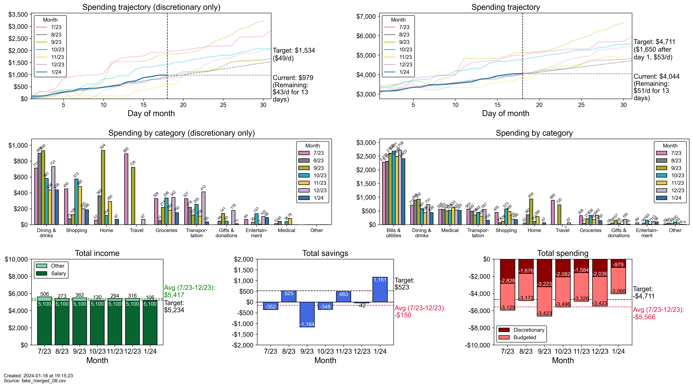

# BudgetBuddy: a command-line budget tracking app


## Table of contents

- Summary
- Requirements
- Installation
- Usage
- Configuration
- To Do


## Summary

BudgetBuddy is a command-line app that I use to keep track of my spending habits. It was born out of a frustration with personal finance apps like Mint or RocketMoney. After a month or two of trying and failing to find an app with all of the features I wanted, I decided to make one myself.

BudgetBuddy is somewhat customized to my specific use cases and was not originally intended to be publicly useful. For that reason, there's not much in the way of documentation, although I'd be happy to answer questions. Some pieces of the package would be unnecessary for most people, but the base code could be useful to someone else.

BudgetBuddy currently has some sections that are messy due to accumulated patches (especially plotting.py and importing.py). I mean to refactor them eventually when I have a bit of time. :)


## Requirements

- Python 3.11 or higher


## Installation

To install this package, run the following command:

```bash
pip install git+https://github.com/tesslinden/budgetbuddy.git
```

For next steps, see "Configuration."


## Configuration

TODO


## Usage

By default (if you run `budgetbuddy` with no arguments), BudgetBuddy will run in merge-and-plot mode, which does the following:
1. **Import history:** Import the most recent merged transactions file
2. **Import manual transactions:** Import the manual transactions file and check if any new transactions are present or if any transactions have been deleted
3. **Import other transactions:** Import the raw transactions files and look for any new transactions not found in the merged file; if there are new transactions, ask the user to annotate them
4. **Merge:** Make a new merged file with the deletions and additions identified in steps 2 & 3; save it in the merged transactions folder
5. **Plot:** Import the budget file; use the budget file and the new merged file from step 4 to plot spending and income patterns for the past 6 months; save the plot in the plots folder 

Here is an example output made with mock data: 


The default merge-and-plot mode accepts some arguments to modify its behavior: for example, `--plot False` skips step 5; `--merge False` skips steps 2-4; `-i filename.csv` specifies a file to import in step 1 and skips steps 2-4.

BudgetBuddy can also be run in two other modes that are mutually exclusive with the default merge-and-plot mode: 
* Search mode: if `--keyword` and/or `--filter` arguments are specified, BudgetBuddy will import the most recent merged transactions file and print any rows matching the queries specified by the arguments.
* Find & replace mode: if `--replace` argument is specified, BudgetBuddy will find & replace the specified phrase(s) in all previous transactions files.

For more details, run `budgetbuddy --help`.


## To Do

* Fix: when multiple merged files w/ same name exist, overwrite most recent one (e.g. "_02") NOT the one w/o suffix
* Rework config: add --config argument to enter configuration setting mode; encode config as json instead of py
* Write unit tests
* Rework importing process so that old raw transactions files are ignored
* Debug bar plot label positioning (adjustText library might be useful)
* Move more hard-coded parameters to config (e.g. plotting parameters, categories & subcategories)
* Refactor plotting.py and importing.py which are currently a little bit monstrous
* Add ability to edit merged transaction files via command line
* Add ability to annotate a transaction with a note
* Use termcolor or similar to print tdfs with alternating row colors for better readability